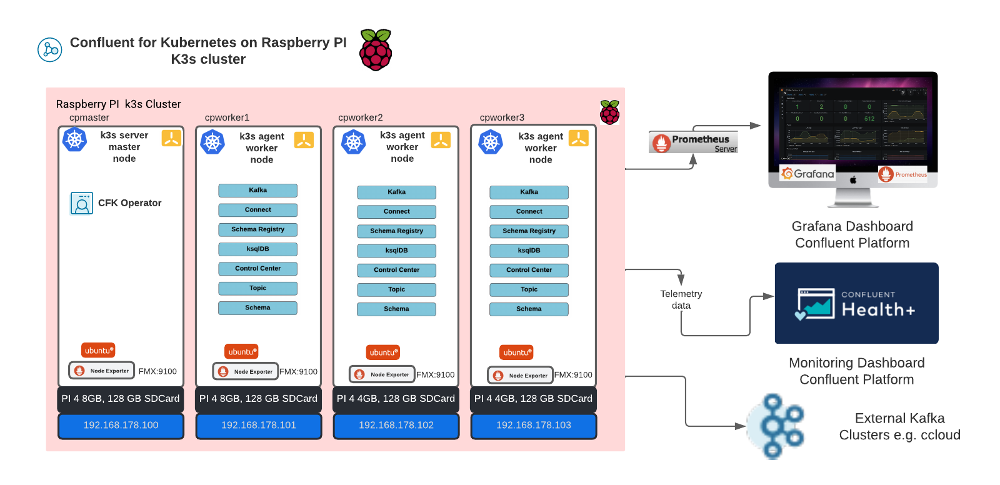

# Running k3s on Raspberry PI cluster with Confluent for Kubernetes

This Repository explains how to setup a k3s cluster on Raspberry PI 4-Node-cluster and deploy Confluent for Kubernetes to use CFK API for continues development (cd) of Confluent components for Confluent Cloud. I will use this cluster as my demo lab.
Follow this guide to create Kubernetes setup step-by-step.



I run a 4 node cluster:
hosts:
192.168.178.100 cpmaster cpmaster.local
192.168.178.101 cpworker1 cpworker1.local
192.168.178.102 cpworker2 cpworker2.local
192.168.178.103 cpworker3 cpworker3.local

The cluster is purely build with RaspBerry PI 4B and 128GB SDCard.

The Installation of each node is documented in the next pages:
* cpmaster with k3s server and later I will install Confuent for Kubernetes Operator
* cpworker1 with k3s Agent
* cpworker2 with k3s Agent
* cpworker3 with k3s Agent

I follow this [setup](https://gist.github.com/syncom/7c6e90708bc28cc9ede2c3245c203e32) first.

# Prepare the cluster, each node step-by-step:

Please build every hardware piece together. Build the cluster, connect the network cables with router and RPIs. Now we prepare the SDCards and setup each Raspberry PI manually. This is quite easy. The most time took to copy Ubuntu on each SDCard.
Sp let's start to prepare and setup the cluster.

* Setup the [cpmaster node](cpmaster.md)
* Setup the [cpworker1 node](cpworker1.md)
* Setup the [cpworker2 node](cpworker2.md)
* Setup the [cpworker3 node](cpworker3.md)

# Deploy Confluent for Kubernetes

The installation of CFP Operator in k3s cluster is ver simple. These pre-reqs have to be there.
Please follow this [guide](cfk_operator.m)

# Use cases 

* Topic Depleyment to Confluent Cloud cluster, follwo this [guide](usecase_ccloudTopic.md)

# Monitoring

Add die RPI Cluster to my Grafana/Prometheus iMac.
Coming soon.

# Scripts
I did prepare three scripts under `scripts` folder.
* `98_startup_k3scluster.sh` start the k3s cluster software
* `99_stop_k3scluster.sh` stop the k3s cluster software
* `99_shutdown_k3scluster.sh` shutdown the compleze Raspberry PIs. After shutdown you can switch off the power.

# Software

we will use the following software to run the cluster on Raspberry PIs
* Ubuntu OS Server 23.10 64-bit
* Helm
* kubectl
* docker
* k3s , v1.27.7+k3s2
* Confluent for Kubernetes 2.7

## Upgrade from 23.10 to 24.04

Follow the steps and see  [Upgrade](https://help.ubuntu.com/community/EOLUpgrades)

```bash
# UPGRADE FROM 23.10 to 24.04
# which version
cat /etc/os-release
# Follow Upgrade https://help.ubuntu.com/community/EOLUpgrades
sudo vi /etc/apt/sources.list
# replace ports.ubuntu.com/ubuntu-ports to old-releases.ubuntu.com/ubuntu

sudo apt-get update
sudo apt-get dist-upgrade
sudo reboot
sudo do-release-upgrade
```

# Hardware

We will run with Raspberry PI 4B. Best would be with 8 GB RAM, but this is not easy to get today. 4GB RAM do work also quite good. I did add a buying list with links to Amazon, but please keep in mind that Amazon prices are maybe not the best:
* 2 x [Raspberry PI 4 4GB RAM](https://amzn.to/3FwZHX0) and 2 x [Raspberry PI 4 8GB RAM](https://amzn.to/3L47MDK) (Raspberry )
    * 1 x [RPI cluster buildcase](https://amzn.to/3RaEDf6)
* 1 x [USB Power Hub](https://amzn.to/3N7t4Uv)
    * 4 x [USB-C Power cable](https://amzn.to/3FHU6xb)
* 1 x [unmanaged Network Router](https://amzn.to/3vUyha8)
    * 1 x [Network cable](https://amzn.to/399lb00)
* 4 x [128 GB SDCard](https://amzn.to/3N7t4Uv)
* 1 x [LED light band](https://amzn.to/3Ftp6AI)
* 1 x [Power Cable](https://amzn.to/3smIaLE)

# Note/license:

***Note***: Confluent fpr Kuebernetes is a commercial software product from Confluent and has to be licensed. You will get for the first 30 days an evaluation license without any charges.
